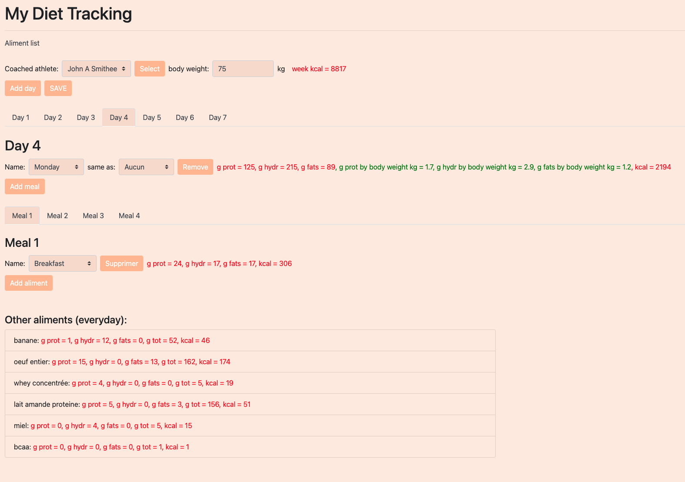
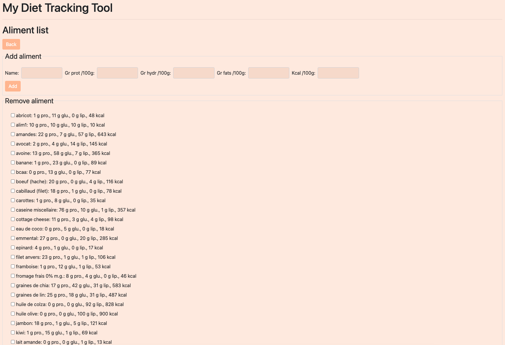
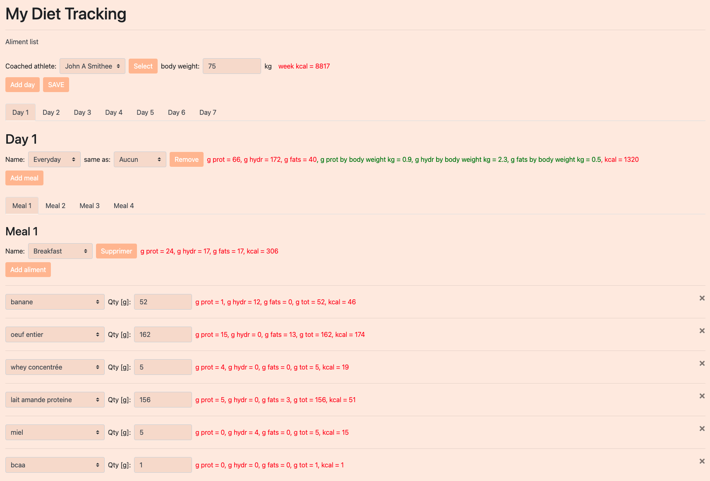

# Diet_track_PHP
An application to track diet calories for an athele.

It is written in PHP with Symfony, Doctrine and Bootstrap. It uses Docker to run as a microservice. 

The database is a MySQL (MariaDB). It runs in a separate Docker container and communicates via the bridge network.

The same application was later converted into a iPhone application: https://github.com/mathieudelehaye/FeedMe

<p float="left">
  
</p>

<p float="left">
  
</p>

<p float="left">
  
</p>

Run it: 

```
docker build --no-cache -t mariadb_image MySQL/
docker run -it -d --name maria_container -p 12345:3306 mariadb_image

docker build --no-cache -t diet_tracker_image Microservice/
docker run -it -d --name diet_tracker_container -p 8081:8000 diet_tracker_image
```

Then connect to the `http://localhost:8081/` address.
