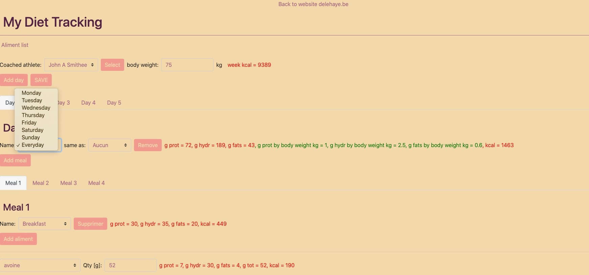

# Diet_track_PHP
An application to track diet calories written in PHP with Symfony and Bootstrap. 

<p float="left">
  
</p>

Run it: 

php composer.phar install

**! Ensure it is possible to write in project sub-directories !** : 

```
sudo chmod -R 777 .
```

Install Symfony Profiler:
```
php composer.phar require --dev symfony/profiler-pack
```

In .env file: check that: APP_ENV=dev

Then: 
```
php bin/console cache:clear --no-warmup --env=dev 
```

Clear Symfony cache: 
```
php bin/console cache:clear 
```

